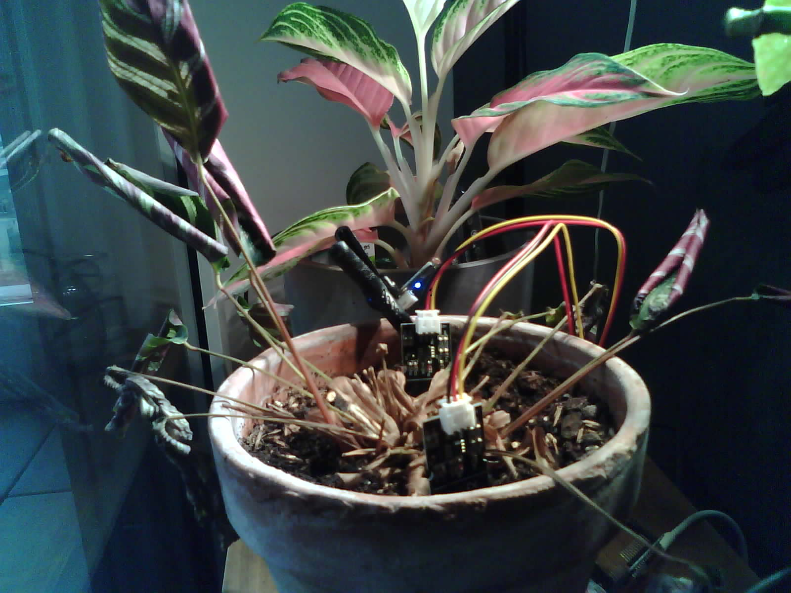

# SmartPlant - ESP32 Plant Monitoring System

**Note:** This project was AI-generated using GitHub Copilot.
**ESPHome:** The ESP32-CAM integration and Home Assistant camera setup are managed via ESPHome.

## Overview
SmartPlant is an IoT plant monitoring system built on ESP32 that monitors soil moisture and light levels. Data is published via MQTT to Home Assistant for centralized monitoring and automation. The ESP32-CAM camera integration is implemented using ESPHome for easy configuration and OTA management.

## Features
- 📊 Dual capacitive moisture sensors (D32, D33)
- 💡 Photoresistor light sensor (D34)
- 📡 MQTT publishing every 5 minutes
- 🏠 Home Assistant integration via MQTT
- 🔧 OTA (Over-The-Air) updates
- 🔒 Secure credential management via `config.h`
 - 📷 ESP32-CAM plant monitoring (see `esp32cam.yaml`)

## Hardware Setup

### Components
- ESP32 (WROOM/WROVER variant)
- 2x Capacitive moisture sensors
- 1x Sunfounder photoresistor (3-pin: GND/VCC/SIG)
- USB cable for initial flashing

### Pin Configuration
| Component | GPIO Pin | Notes |
|-----------|----------|-------|
| Moisture Sensor 1 | D32 | ADC input |
| Moisture Sensor 2 | D33 | ADC input |
| Light Sensor | D34 | ADC input (SIG pin) |
| Relay (future) | D18 | Optional, currently unused |

## Software Requirements
- Arduino IDE 1.8.x or later
- ESP32 board support installed in Arduino IDE
- Required libraries:
  - WiFi.h (built-in)
  - PubSubClient
  - ArduinoOTA

## Configuration

### 1. Create `config.h`
Create a file named `config.h` in the project directory with your credentials:

```cpp
#ifndef CONFIG_H
#define CONFIG_H

// WiFi Configuration
#define WIFI_SSID "your_wifi_network"
#define WIFI_PASSWORD "your_wifi_password"

// MQTT Configuration
#define MQTT_BROKER "192.168.1.11"
#define MQTT_PORT 1883
#define MQTT_USER "mqtt_username"
#define MQTT_PASSWORD "mqtt_password"
#define MQTT_TOPIC "smartplant"

// OTA Configuration
#define OTA_HOSTNAME "SmartPlant"
#define OTA_PASSWORD "ota_password"

#endif
```

### 2. Sensor Calibration

Edit the calibration values in `smartplant.ino`:

```cpp
// Moisture calibration (default: dry=2570, wet=1050)
const int MOISTURE_DRY = 2570;    // Reading when completely dry
const int MOISTURE_WET = 1050;    // Reading when completely saturated

// Light calibration (0-4095 raw ADC values)
const int LIGHT_MIN = 0;          // Dark environment reading
const int LIGHT_MAX = 4095;       // Bright environment reading
```

## Installation & Flashing

### Initial Setup (USB)
1. Connect ESP32 to computer via USB
2. In Arduino IDE:
   - Select **Tools → Board → ESP32**
   - Select correct **Port** (Tools → Port)
   - Set **Baud Rate to 115200**
3. Upload sketch: **Sketch → Upload**
4. Monitor output: **Tools → Serial Monitor**

### OTA Updates (Wireless)
1. First successful upload enables OTA
2. Watch Serial Monitor for: `OTA Ready - IP: [IP_ADDRESS]`
3. In Arduino IDE:
   - Select **Tools → Port → SmartPlant at [IP_ADDRESS]**
   - Upload normally

### ESP32-CAM (Plant Camera)
An optional camera setup is provided to visually monitor the plant.

- Configuration file: `esp32cam.yaml`
- Purpose: Adds an ESP32-CAM to Home Assistant for live video and snapshots (via ESPHome)
- Typical use: Track plant growth, detect over/under-watering visually

Example (Home Assistant camera configuration):

```yaml
camera:
  - platform: generic
    name: SmartPlant Camera
    still_image_url: http://<esp32cam-ip>/capture
    stream_source: http://<esp32cam-ip>:81/stream
```

ESPHome approach (recommended): Define the ESP32-CAM in ESPHome and let Home Assistant auto-discover it. Manage WiFi, OTA, and camera settings in ESPHome without hardcoding secrets in this repo.

#### Plant Snapshot
As part of documenting the rescue effort for a dying plant, a snapshot was taken and stored in the ESPHome folder.

- Snapshot file: `esphome/snapshot_camera_esp32cam_esp32_cam_13.12.2025.jpg`
- Purpose: Track plant condition visually alongside sensor data



## MQTT Topics

The device publishes to the following topics (prefix: `smartplant/sensor/`):

| Topic | Value | Unit | Update Interval |
|-------|-------|------|-----------------|
| `moisture1` | 0-100 | % | 5 minutes |
| `moisture2` | 0-100 | % | 5 minutes |
| `moisture_avg` | 0-100 | % | 5 minutes |
| `light` | 0-4095 | Raw ADC | 5 minutes |

## Home Assistant Integration

Add to your Home Assistant `configuration.yaml` or `mqtt.yaml`:

```yaml
mqtt:
  sensor:
    - name: "SmartPlant Moisture 1"
      state_topic: "smartplant/sensor/moisture1"
      unit_of_measurement: "%"
      device_class: humidity
      state_class: measurement

    - name: "SmartPlant Moisture 2"
      state_topic: "smartplant/sensor/moisture2"
      unit_of_measurement: "%"
      device_class: humidity
      state_class: measurement

    - name: "SmartPlant Moisture Average"
      state_topic: "smartplant/sensor/moisture_avg"
      unit_of_measurement: "%"
      device_class: humidity
      state_class: measurement

    - name: "SmartPlant Light"
      state_topic: "smartplant/sensor/light"
      unit_of_measurement: "ADC"
      state_class: measurement
```

## Serial Monitor Output

Expected output on startup:
```
SmartPlant - Starting...
Connecting to WiFi: your_network
.....
WiFi connected!
IP address: 192.168.1.100
Attempting MQTT connection...connected!
OTA Ready - IP: 192.168.1.100
Sensor 1: 1500 (50%) | Sensor 2: 1600 (45%) | Avg: 47% | Light: 2100
```


## Troubleshooting

### Serial Monitor Not Connecting
- Close Serial Monitor completely before uploading
- Wait 2-3 seconds after upload completes
- Reopen Serial Monitor and select correct port at 115200 baud

### WiFi Connection Issues
- Verify WIFI_SSID and WIFI_PASSWORD in config.h
- Check distance from router
- Ensure 2.4GHz band is enabled (ESP32 doesn't support 5GHz)

### MQTT Not Publishing
- Verify MQTT_BROKER IP address and port
- Check MQTT_USER and MQTT_PASSWORD credentials
- Ensure MQTT broker is running and accessible
- Monitor with: `mosquitto_sub -h 192.168.1.11 -u user -P pass -t "smartplant/#"`

### Sensor Readings Seem Wrong
- Verify ADC pins are not damaged
- Check solder connections
- Re-calibrate MOISTURE_DRY and MOISTURE_WET values
- Ensure sensors are properly inserted into soil

## File Structure
```
SmartPlant/
├── smartplant.ino          # Main sketch
├── config.h                # Credentials (git-ignored)
├── .gitignore              # Git ignore rules
├── esp32cam.yaml           # Home Assistant config for ESP32-CAM
└── README.md               # This file
```

## Future Enhancements
- Add relay control via MQTT subscription (pump)
- Deep sleep for power efficiency
- Temperature/humidity sensor
- Web dashboard interface
- **Node-RED Integration**: Transform MQTT requests to API calls for external services
- **InfluxDB Integration**: Store time-series sensor data for historical analysis
 - **Grafana Dashboard**: Create interactive visualizations and analytics dashboards from InfluxDB data
 - **ESP32-CAM Automations**: Motion-based snapshots, time-lapse, and HA notifications

## License
This project is provided as-is for personal use.

---

**Generated with GitHub Copilot** - AI assistance used for code development and documentation.
